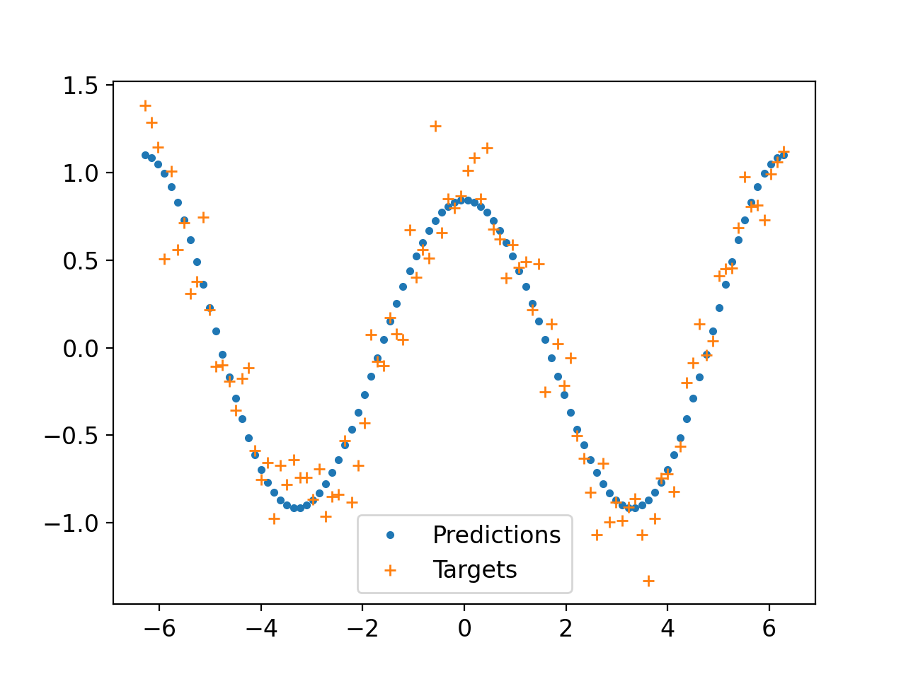
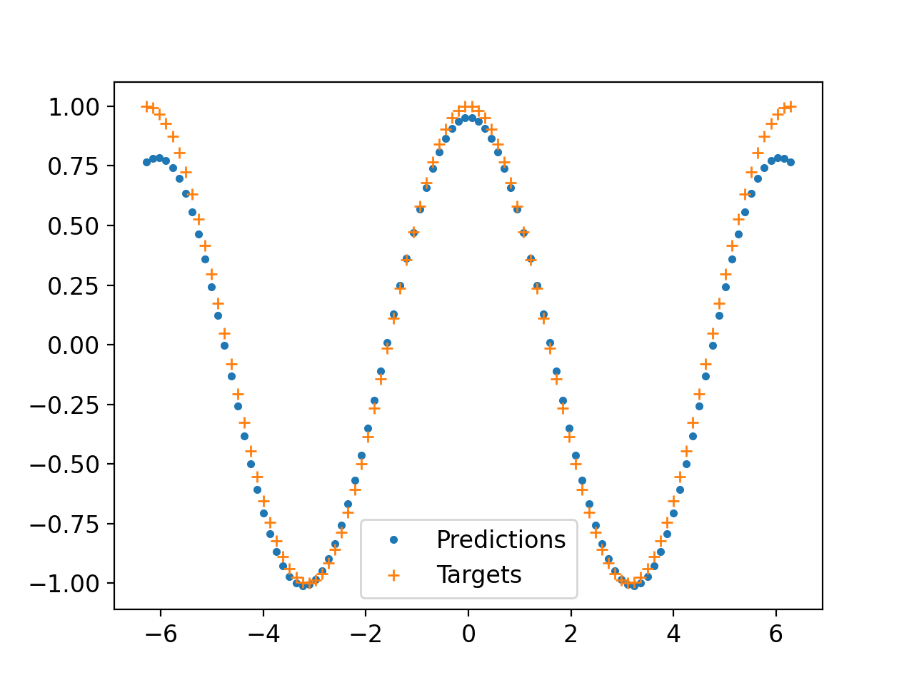

# Implementing SGD

## 7 steps of SGD

### Step 1: Init the parameters

Initialize to random values and ensure that gradients are turned on for them. 

Create a rank 1 tensor with 3 values. 

### Step 2: Make predictions

Calculate the predictions given your init parameters

> to graph you need to use .detach() on predictions to get the tensor values since grad is applied

### Step 3: Calculate the loss

Use the Mean Squared Error to find the loss

### Step 4: Calculate Gradients

Apply backwards to the loss
Then check the grad on the params

> damn Pytorch takes care of everything for you

### Step 5: Step up the weights

Decide the learning rate
apply the learning rate of the params
set the grad to None to restart the process

> To access the raw values of the grad use the .grad.data function. 
> Hard to see in one step so create a function that does all of this for you and iterate through a loop

### Step 6: 

Repeat step 2 through 5 in a loop (steps 2-5 can be made into a function)

### Step 7: 

Stop the descent
This can be an arbitrary decision but can also be based on some heuristic.

## Applying What I've learned

I applied the 7 steps to approximate a cos function.  Really simple, just to motivate the intuition for the technique.

Used the Mclaurin approximation:  $cos(x) \approx a_0 - a_1\frac{x^2}{2!}+a_2\frac{x^4}{4!}-a_3\frac{x^6}{6!}+a_4\frac{x^8}{8!}$

Where the $a_0 - a_4$ are the parameters (weights) with which I apply the gradient adjustments. Ended up using the 7th approximation cause why not.

Used the torch.cos as the target. Tried both with noise and without.

Again this is not about the best cos approximator just building intuition on SGD.

The way I see it, the target is some n-dim surface (using that term loosely here), the predictions are points along a blanket you are laying over the top of the surface.  Then you push all of the spots where voids are felt. You push with a force determined by the gradient of the "difference" or "loss" between the blanket and the surface and the importance you give that gradient (learning rate). Theoretically, this process could fill in all of the nooks and crannies of that surface arbitrarily over a long enough period.  In practice this would lead to over-fitting of noisy data and take a really long time in some cases.  This is where my analogy falls apart.  I could make a more contrived version by saying that the blanket is a special one that (should) settles on the gestalt of your surface, but who likes analogies anyway?  

## Running the code

Clone the repo and run `pip3 install -r requirements.txt` in the command line

then run `python3 COS_SGD.py`

Expand the window for better viewing experience.  You can also edit the frame rate to move faster or slower throughout the descent.

